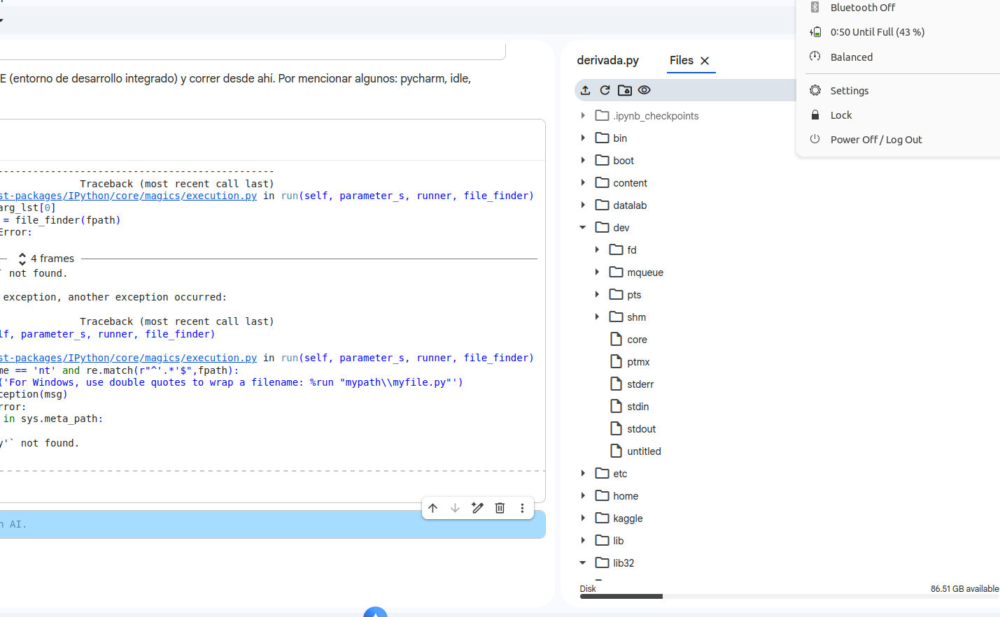

# Marine-Acoustic-Signal-Processing
A signal-processing project that applies frequency-domain analysis, filtering methods, and spectral visualization techniques to marine acoustic datasets. The workflow demonstrates practical applications of scientific computing in environmental monitoring and oceanographic research.

## Overview

This project explores acoustic signal processing techniques applied to marine monitoring datasets.

The goal is to develop a workflow for analyzing underwater acoustic signals using methods commonly employed in oceanographic and environmental monitoring applications.

The project demonstrates skills in:

* Signal processing
* Spectral analysis
* Scientific programming
* Data visualization
* Environmental data analysis

## Research Questions

* What frequency components dominate the signal?
* How do signal characteristics evolve over time?
* Which filtering techniques improve signal interpretation?
* How can acoustic information be visualized effectively?

## Methods

* Fast Fourier Transform (FFT)
* Spectrogram analysis
* Digital filtering
* Frequency-domain visualization

## Tools

* Python
* NumPy
* SciPy
* Matplotlib

## Results

* Spectrograms
* Frequency distributions
* Filtered signal analysis
* Automated signal-processing pipeline

## Repository Structure

data/
notebooks/
src/
figures/
results/

README.md

